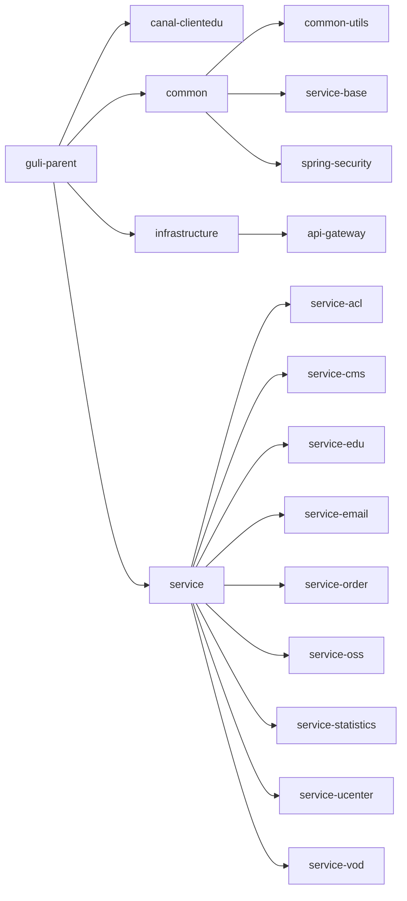
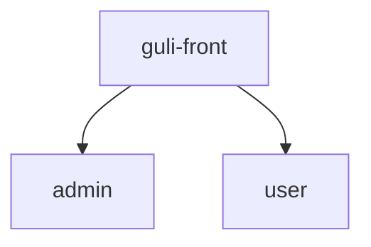
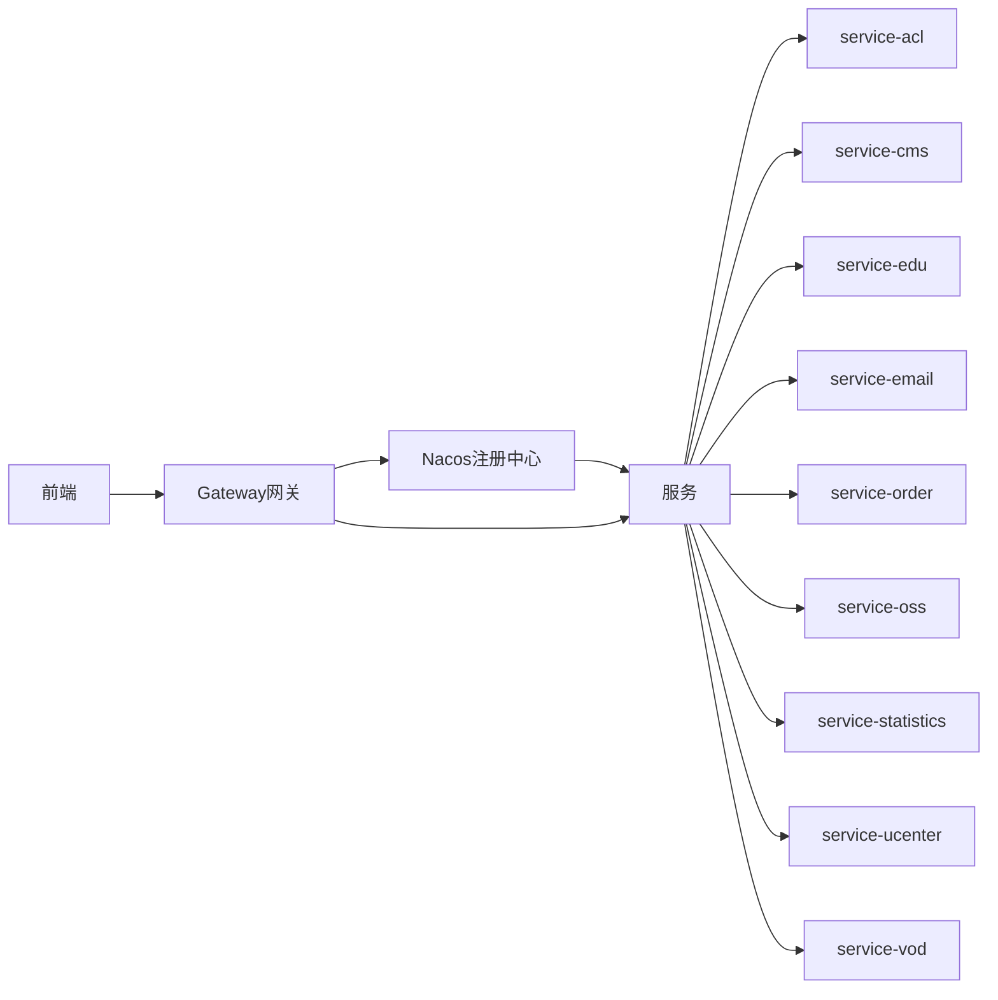
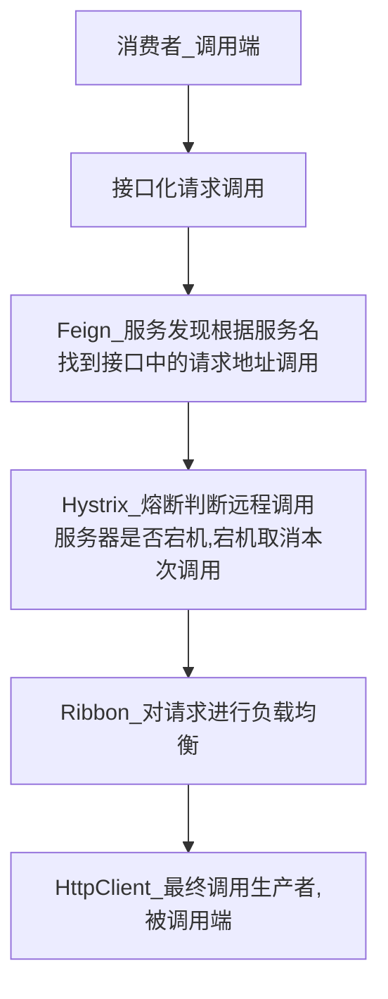

后端项目结构图



| 模块名             | 说明                                   |
| ------------------ | -------------------------------------- |
| common-utils       | 公共工具类                             |
| service-base       | 公共实体类                             |
| spring-security    | 用户认证鉴权                           |
| api-gateway        | 网关                                   |
| service-acl        | 权限管理                               |
| service-cms        | 用户主界面                             |
| service-edu        | 课程、讲师管理                         |
| service-email      | 用户邮箱注册                           |
| service-order      | 付费课程订单模块                       |
| service-oss        | 阿里云对象存储                         |
| service-statistics | 数据统计                               |
| service-ucenter    | 用户管理，以及第三方登录(微信、github) |
| service-vod        | 阿里云视频点播                         |

前端项目结构



| 模块名 | 说明         |
| ------ | ------------ |
| admin  | 后台管理系统 |
| user   | 前台展示系统 |

工作原理




## OSS配置

1. 前往[aliyun官网](https://oss.console.aliyun.com/overview)开通`OSS`服务
2. 在`aliyun`官网创建一个`Bucket`

3. 修改`service_oss`模块的配置文件为自己的配置

   ```yaml
   aliyun:
       oss:
           file:
               endpoint: 
               key-id: 
               key-secrete: 
               bucket-name: 
   ```

## 视频点播

1. 先到[aliyun官网](https://www.aliyun.com/product/vod)开通视频点播服务

2. 引入依赖

   因为aliyun-sdk-vod-upload没有开源，需要手动安装到本地仓库使用，首先在[官网下载](https://alivc-demo-cms.alicdn.com/versionProduct/sourceCode/upload/java/VODUploadDemo-java-1.4.14.zip?spm=a2c4g.11186623.0.0.77894a92sGk5iz&file=VODUploadDemo-java-1.4.14.zip)解压后进入`lib`目录，执行以下命令

   ```shell
   mvn install:install-file -DgroupId=com.aliyun -DartifactId=aliyun-sdk-vod-upload -Dversion=1.4.14 -Dpackaging=jar -Dfile=aliyun-java-vod-upload-1.4.14.jar
   ```

3. 修改`service\service_vod\src\main\resources\application.yml`为自己的配置，一般来说与OSS配置相同

   ```yaml
   aliyun:
       vod:
           file:
               keyid: 
               keysecret:
   ```

## Nacos



### 注册中心

1. 在[github](https://github.com/alibaba/nacos/releases/tag/1.1.4)下载

2. 修改启动脚本

   ```shell
   set MODE="cluster" 
   ```

   改为

   ```shell
   set MODE="standalone"
   ```

3. 修改**各模块**的注册中心地址

   ```yaml
   server:
       cloud:
           nacos:
               discovery:
                   server-addr: 127.0.0.1:8848
   ```

4. `nacos`的默认地址为

   ```
   http://localhost:8848/nacos
   用户名: nacos
   密码: nacos
   ```

### 配置中心

如果需要配置中心

1. 在`nacos`中创建对应模块的配置文件，文件名格式如下

   ```
   ${spring.application.name}-${spring.profiles.active}.yaml
   或者
   ${spring.application.name}-${spring.profiles.active}.properties
   ```

2. 填写配置文件后点击发布

3. 在项目`bootstrap.yaml`中配置

   ```yaml
   spring:
       cloud:
           nacos:
               config:
                   server-addr: 127.0.0.1:8848
                   # 配置文件类型
                   file-extension: yaml
                   # 命名空间 不写默认public
                   namespace: c0553a5e-ce37-4b9c-ad18-b8a4ad97fcee
       # 如果此项不填,则上述的配置文件页不应该有${spring.profiles.active}
       profiles:
           active: dev
       application:
           name: service-statistics
   ```

   

## Redis配置

修改`service_acl`、`service_cms`、`service_email`

```yaml
spring:
    redis:
        host: 127.0.0.1
        port: 6379
        database: 0
        timeout: 1800000
		# 没有密码删除此行
        password: 123456
        lettuce:
            pool:
                max-active: 20
                max-wait: -1
                # 阻塞时间
                max-idle: 5
                min-idle: 0
```

## 邮箱配置

修改`service\service_email\src\main\resources\application.yml`

目前仅测试了qq邮箱，别的邮箱自行测试

```yaml
spring:
    # qq邮箱
    mail:
        # 配置 SMTP 服务器地址
        host: smtp.qq.com
        # 发送者邮箱
        username: xxxx@qq.com
        # 配置密码，注意不是真正的密码，而是刚刚申请到的授权码
        password: xxxx
        # 465或者587
        port: 587
        # 默认的邮件编码为UTF-8
        default-encoding: UTF-8
        # 配置SSL 加密工厂
        properties:
            mail:
                smtp:
                    auth: true
                    socketFactoryClass: javax.net.ssl.SSLSocketFactory
                    starttls:
                        enable: true
                        required: true
```

## 第三方登录

修改`service\service_ucenter\src\main\resources\application.yml`

```yaml
# 前端主页面
front:
    homepage: http://localhost:3000
# 微信登录
wechat:
    open:
        app-id: 
        app-secret: 
        redirect-url: 
# github登录
github:
    open:
        client-id: 
        client-secret: 
        redirect-url: http://localhost:8006/educenter/member/github/callback
```

## 微信支付

修改`service\service_order\src\main\resources\application.yml`

```yaml
wechat:
    pay:
        #关联的公众号appid
        appid: 
        #商户号
        partner: 
        #商户key
        partner-key: 
        #回调地址
        notify-url: 
        # 订单ip
        addr: 127.0.0.1
```

## Canal配置

1. 数据库配置

   修改`mysql`数据库的`my.cnf`或者`my.ini`

   ```ini
   # binlog文件名
   log-bin=mysql-bin
   # 选择row模式
   binlog_format=ROW
   # mysql实例id不能和canal的slaveId重复
   server_id=1
   ```

   数据库添加一个用户

   ```sql
   CREATE USER 'canal'@'%' IDENTIFIED BY 'canal';
   GRANT SHOW VIEW, SELECT, REPLICATION SLAVE, REPLICATION CLIENT ON *.* TO 'canal'@'%';
   FLUSH PRIVILEGES;
   ```

2. `canal`配置

   ```properties
   # 数据库的位置
   canal.instance.master.address=xxxx:3306
   
   canal.instance.dbUsername=canal
   canal.instance.dbPassword=canal
   
   canal.instance.filter.regex=.*\\..*
   ```


## 参看文档

- [阿里云对象存储](https://help.aliyun.com/document_detail/195870.html)

- [EasyExcel ](https://www.yuque.com/easyexcel/doc/easyexcel)

- [阿里云视频点播](https://vod.console.aliyun.com/#/guide)

  [文档地址](https://help.aliyun.com/product/29932.html)

- [ECharts](https://echarts.apache.org/zh/index.html)
